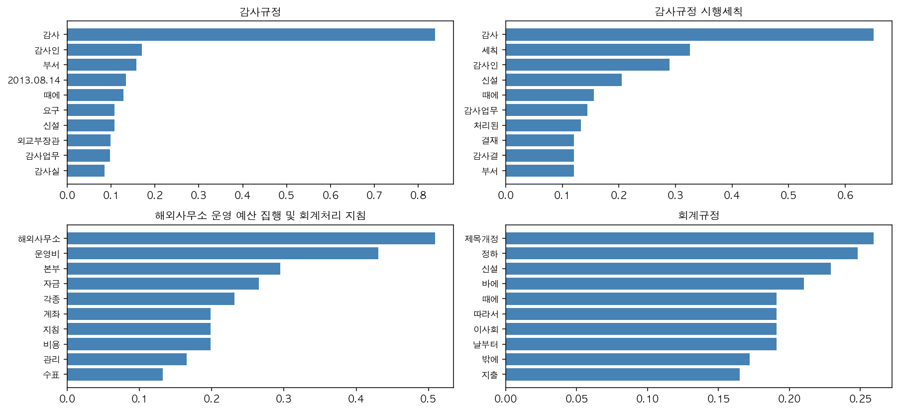

# KOICA 회계규정 텍스트마이닝 보고서

- **카테고리**: `finance` (회계규정)
- **분석 대상**: 규정 4건 · 조문 172개
- **생성 시각**: 2026-06-09 12:57
- **방법**: 규정 단위 TF-IDF, 상위 15 키워드 추출

## 1. 전체 워드클라우드

## 2. 규정별 상위 키워드 (TOP 10)

## 3. 규정별 키워드 요약

### 감사규정

**감사** (0.839) · **감사인** (0.170) · **부서** (0.158) · **2013.08.14** (0.134) · **때에** (0.128) · **요구** (0.108) · **신설** (0.108) · **외교부장관** (0.098) · **감사업무** (0.097) · **감사실** (0.085)

### 감사규정 시행세칙

**감사** (0.650) · **세칙** (0.325) · **감사인** (0.289) · **신설** (0.205) · **때에** (0.156) · **감사업무** (0.145) · **처리된** (0.132) · **결재** (0.120) · **감사결** (0.120) · **부서** (0.120)

### 해외사무소 운영 예산 집행 및 회계처리 지침

**해외사무소** (0.509) · **운영비** (0.431) · **본부** (0.295) · **자금** (0.265) · **각종** (0.232) · **계좌** (0.199) · **지침** (0.199) · **비용** (0.199) · **관리** (0.166) · **수표** (0.132)

### 회계규정

**제목개정** (0.259) · **정하** (0.248) · **신설** (0.229) · **바에** (0.210) · **때에** (0.191) · **따라서** (0.191) · **이사회** (0.191) · **날부터** (0.191) · **밖에** (0.172) · **지출** (0.165)

---

> 생성: ktm (KOICA Text Mining skill). 데이터 출처: koica-reg-mcp.
