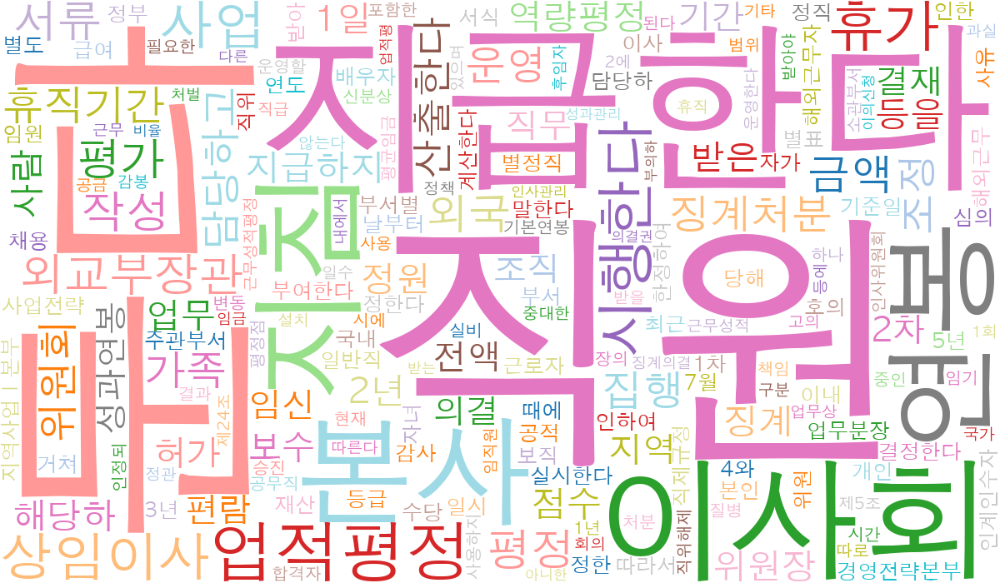
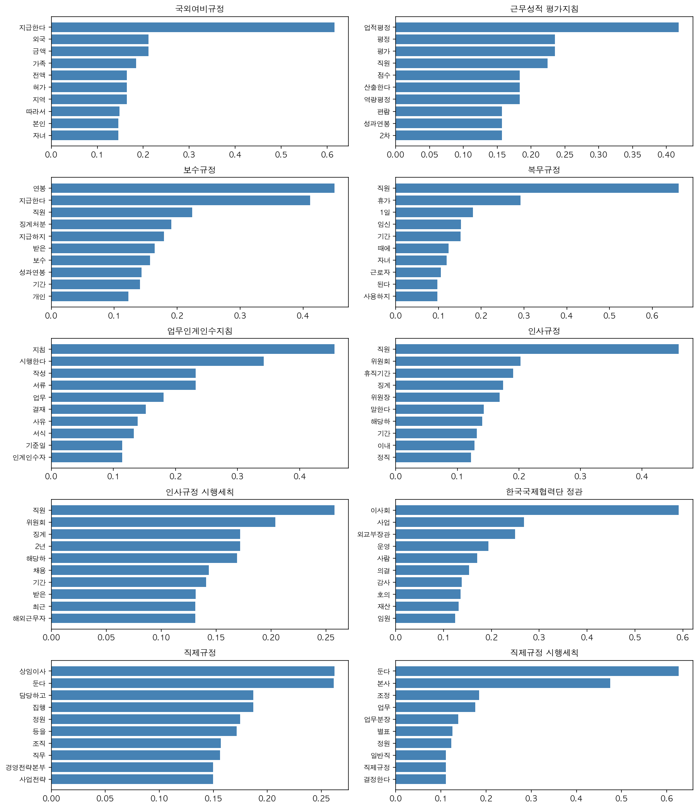

# KOICA 인사규정 텍스트마이닝 보고서

- **카테고리**: `hr` (인사규정)
- **분석 대상**: 규정 10건 · 조문 381개
- **생성 시각**: 2026-05-21 12:34
- **방법**: 규정 단위 TF-IDF, 상위 15 키워드 추출

## 1. 전체 워드클라우드

## 2. 규정별 상위 키워드 (TOP 10)

## 3. 규정별 키워드 요약

### 국외여비규정

**지급한다** (0.616) · **외국** (0.211) · **금액** (0.211) · **가족** (0.185) · **전액** (0.164) · **허가** (0.164) · **지역** (0.164) · **따라서** (0.148) · **본인** (0.146) · **자녀** (0.146)

### 근무성적 평가지침

**업적평정** (0.419) · **평정** (0.235) · **평가** (0.235) · **직원** (0.224) · **점수** (0.183) · **산출한다** (0.183) · **역량평정** (0.183) · **편람** (0.157) · **성과연봉** (0.157) · **2차** (0.157)

### 보수규정

**연봉** (0.450) · **지급한다** (0.411) · **직원** (0.224) · **징계처분** (0.191) · **지급하지** (0.179) · **받은** (0.164) · **보수** (0.157) · **성과연봉** (0.143) · **기간** (0.141) · **개인** (0.123)

### 복무규정

**직원** (0.662) · **휴가** (0.292) · **1일** (0.181) · **임신** (0.153) · **기간** (0.151) · **때에** (0.123) · **자녀** (0.119) · **근로자** (0.105) · **된다** (0.097) · **사용하지** (0.097)

### 업무인계인수지침

**지침** (0.456) · **시행한다** (0.342) · **작성** (0.233) · **서류** (0.233) · **업무** (0.181) · **결재** (0.152) · **사유** (0.139) · **서식** (0.133) · **기준일** (0.114) · **인계인수자** (0.114)

### 인사규정

**직원** (0.460) · **위원회** (0.203) · **휴직기간** (0.191) · **징계** (0.174) · **위원장** (0.168) · **말한다** (0.143) · **해당하** (0.141) · **기간** (0.132) · **이내** (0.128) · **정직** (0.123)

### 인사규정 시행세칙

**직원** (0.258) · **위원회** (0.204) · **징계** (0.172) · **2년** (0.172) · **해당하** (0.169) · **채용** (0.143) · **기간** (0.141) · **받은** (0.132) · **최근** (0.131) · **해외근무자** (0.131)

### 한국국제협력단 정관

**이사회** (0.592) · **사업** (0.268) · **외교부장관** (0.249) · **운영** (0.194) · **사람** (0.170) · **의결** (0.153) · **감사** (0.138) · **호의** (0.136) · **재산** (0.131) · **임원** (0.125)

### 직제규정

**상임이사** (0.262) · **둔다** (0.262) · **담당하고** (0.187) · **집행** (0.187) · **정원** (0.175) · **등을** (0.172) · **조직** (0.157) · **직무** (0.156) · **경영전략본부** (0.150) · **사업전략** (0.150)

### 직제규정 시행세칙

**둔다** (0.627) · **본사** (0.475) · **조정** (0.184) · **업무** (0.176) · **업무분장** (0.139) · **별표** (0.126) · **정원** (0.123) · **일반직** (0.111) · **직제규정** (0.111) · **결정한다** (0.111)

---

> 생성: ktm (KOICA Text Mining skill). 데이터 출처: koica-reg-mcp.
